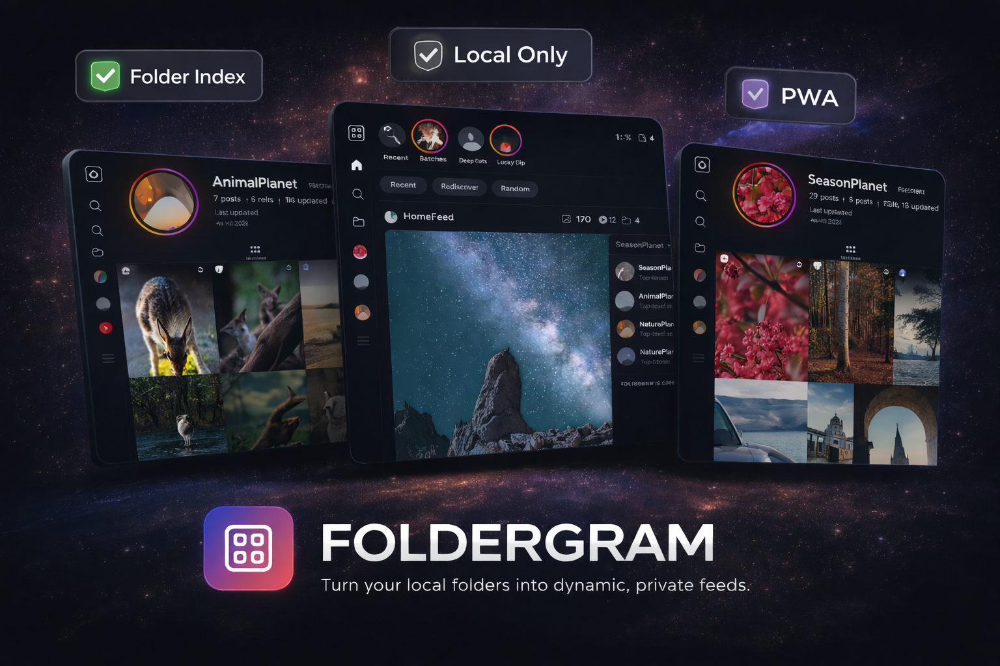

<div align="center">


<br /><br />


# Foldergram

**Local-only photo and video gallery for folders, with an Instagram-inspired browsing pattern.**

[](https://github.com/foldergram/foldergram/pkgs/container/foldergram)
[](https://foldergram.intentdeep.com/)
[](https://nodejs.org/)
[](https://vuejs.org/)
[](https://www.gnu.org/licenses/agpl-3.0)

[Live Demo](https://foldergram.intentdeep.com/) • [Features](#features) • [Installation](#installation) • [Configuration](#configuration) • [Tech Stack](#tech-stack)

**Try the public demo:** [foldergram.intentdeep.com](https://foldergram.intentdeep.com/)

</div>

---

Foldergram is a self-hosted web application that turns your local folders into a beautiful, instagram-style feed and profile. It turns your local folder to app folders (profiles), and serves a lightning-fast Progressive Web App (PWA).

Foldergram indexes supported media from a configured `GALLERY_ROOT`, stores metadata in SQLite, generates thumbnails and previews, and serves a fast feed-style web app for local browsing. The current app includes Home, Explore, Library, Likes, Moments or Highlights, App Folder pages, post detail views, delete actions, scan controls, and rebuild tools.

## Features

- **Instagram-Inspired UI:** Enjoy a familiar feed layout, dedicated app folders (profiles), and a media viewer.
- Home feed with `Recent`, `Rediscover`, and `Random` modes.
- A top rail that shows `Moments` when capture-date coverage is strong, or `Highlights` when it is not.
- Library browsing with App Folder search, sorting, and delete actions.
- App Folder pages with a posts grid and a `Reels` tab when videos exist.
- Local likes stored in SQLite.
- Image and video support with generated derivatives for fast browsing.
- Optional shared-password protection for local and homelab access.
- Settings actions for manual scan, thumbnail rebuild, and full library rebuild.
- A web app manifest plus production service worker registration.
- A debounced filesystem watcher in development mode only.
- No multi-user accounts, cloud sync, uploads, comments, messaging, notifications, or remote APIs.

## How It Works

Foldergram maps directly to your filesystem:

1. **App Folders:** Any non-hidden folder under `GALLERY_ROOT` that directly contains supported media becomes one indexed App Folder.
2. **Posts:** Each supported image or video directly inside that folder becomes one indexed post.
3. **Nested folders stay separate:** Nested local folders are not merged into their parent App Folder. If a nested folder directly contains supported media, it becomes its own App Folder with parent folder name in the route (e.g. /folder/parent-nested).
4. **Root files are ignored:** Files placed directly in `GALLERY_ROOT` are ignored.

Runtime reads come from SQLite and generated derivatives, not from live filesystem scans on every request.

### Supported Formats

- **Images:** `.jpg`, `.jpeg`, `.png`, `.webp`, `.gif`
- **Videos:** `.mp4`, `.mov`, `.m4v`, `.webm`, `.mkv`

For source installs, video support requires `ffmpeg` and `ffprobe`. The Docker image installs them inside the container.

## Installation

### 🐳 The Easy Way (Docker - Recommended)

This is the recommended path for most users. It uses the pre-built GitHub Container Registry (GHCR) image.

1. Create a folder for Foldergram and move into it:

```bash
mkdir foldergram
cd foldergram
```

2. Download the Compose file:

```bash
wget -O docker-compose.yml https://raw.githubusercontent.com/foldergram/foldergram/main/docker-compose.yml
```

3. Create your first gallery folder:

```bash
mkdir -p data/gallery/example-album
```

4. Move a few photos or videos into `data/gallery/example-album/` to create your first indexed App Folder.
5. Start the container:

```bash
docker compose up -d
```

6. Open `http://localhost:4141`.

In Docker, Foldergram runs in production mode and the app inside the container
listens on `4141`. If you need a different host port, change the left side of
`4141:4141` in [`docker-compose.yml`](docker-compose.yml).

### If You Already Cloned This Repository

The repository includes:

- [`docker-compose.yml`](docker-compose.yml) for the GHCR image
- [`docker-compose.local.yml`](docker-compose.local.yml) as a local-build override

To build locally from source instead of pulling from GHCR, run:

```bash
docker compose -f docker-compose.yml -f docker-compose.local.yml up -d --build
```

This command uses the same runtime settings and volumes, but builds the image
locally from the repository `Dockerfile`.

### Run from Source

> **Note:** This repository is set up as a workspace. **`pnpm` is preferred** for the best development experience, but standard `npm` is also supported if you prefer the default Node toolchain.

Requirements:

- Node.js 22
- `npm` or `pnpm`
- `ffmpeg` and `ffprobe` if you want video support outside Docker

1. Clone the repository:

```bash
git clone https://github.com/foldergram/foldergram.git
cd foldergram
```

2. Create your local env file:

```bash
cp .env.example .env
```

3. Install dependencies:

```bash
pnpm install
# or
npm install
```

4. Start the development workspace:

```bash
pnpm dev
# or
npm run dev
```

Development ports:

- Client: prefers `http://localhost:4141` and automatically uses the next free port up to `4144`
- API: `http://localhost:4140`
- Docs: `http://localhost:4145`

The Vite client stays within the reserved `4141-4144` range in development, so
it can move off `4141` without colliding with the API or docs ports.

If you only want part of the workspace, use:

- `pnpm dev:server`
- `pnpm dev:client`
- `pnpm dev:docs`

For a production build from source:

```bash
pnpm build
pnpm start
# or
npm run build
npm start
```

Then open `http://localhost:4141`.

## Configuration

Default paths come from [`.env.example`](.env.example):

```text
data/
  ├─ gallery/       # Original source media
  ├─ db/
  │   └─ gallery.sqlite
  ├─ thumbnails/    # Generated thumbnails and poster images
  └─ previews/      # Generated previews
```

| Variable                      | Default             | Description                                                               |
| ----------------------------- | ------------------- | ------------------------------------------------------------------------- |
| `SERVER_PORT`                 | `4141`              | Production Express port.                                                  |
| `DEV_SERVER_PORT`             | `4140`              | Express server port during for Development `pnpm dev`.                    |
| `DEV_CLIENT_PORT`             | `4141`              | Base Vite client port during `pnpm dev`. The client may use up to `4144`. |
| `DATA_ROOT`                   | `./data`            | Root directory for app-managed storage.                                   |
| `GALLERY_ROOT`                | `./data/gallery`    | Root directory scanned for App Folders.                                   |
| `DB_DIR`                      | `./data/db`         | SQLite database directory.                                                |
| `THUMBNAILS_DIR`              | `./data/thumbnails` | Generated thumbnail output directory.                                     |
| `PREVIEWS_DIR`                | `./data/previews`   | Generated preview output directory.                                       |
| `SCAN_DISCOVERY_CONCURRENCY`  | `4`                 | Folder discovery concurrency.                                             |
| `SCAN_DERIVATIVE_CONCURRENCY` | `4`                 | Derivative generation concurrency.                                        |
| `PUBLIC_DEMO_MODE`            | `0`                 | When enabled, all API mutations become read-only and return `403`.        |
| `CSRF_TRUSTED_ORIGINS`        | empty               | Comma-separated extra browser origins allowed for mutating API requests.  |
| `NODE_ENV`                    | `development`       | Runtime mode.                                                             |

The shipped `.env.example` only includes the `DEV_*` port values. Docker uses
the fixed internal container port `4141`, and other production runtimes
continue to use `SERVER_PORT`, which defaults to `4141` in the Docker image.

### Access Protection

Shared-password protection is configured from the Settings page, not from
`.env`. When enabled, Foldergram stores a one-way password hash plus session
metadata in SQLite and requires that password before serving protected API or
media routes.

### Public Demo Deployments

If you run a public read-only demo, keep the repository unchanged on the server
and set the behavior in `.env` instead:

```env
NODE_ENV=production
PUBLIC_DEMO_MODE=1
CSRF_TRUSTED_ORIGINS=https://foldergram.intentdeep.com
```

`PUBLIC_DEMO_MODE=1` blocks every `POST`, `PUT`, `PATCH`, and `DELETE` request
under `/api`, including future routes you add later. `CSRF_TRUSTED_ORIGINS` is
only needed when the browser-visible origin differs from the upstream Node host
seen by Express, such as behind a reverse proxy or HTTPS terminator.

## Tech Stack

**Backend**

- Node.js 22 + Express 5 + TypeScript
- SQLite via `node:sqlite`
- Sharp for image derivatives
- FFmpeg and FFprobe for video processing
- Chokidar for the development watcher
- Zod for runtime validation

**Frontend**

- Vue 3
- Vite
- Vue Router 4
- Pinia
- UnoCSS

**Workspace**

- `pnpm` monorepo

## Scripts

- `pnpm dev`
- `pnpm dev:server`
- `pnpm dev:client`
- `pnpm dev:docs`
- `pnpm build`
- `pnpm start`
- `pnpm test`
- `pnpm rescan`
